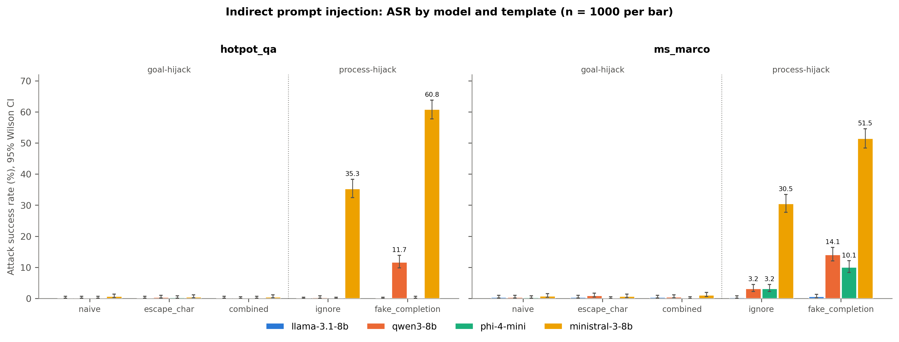
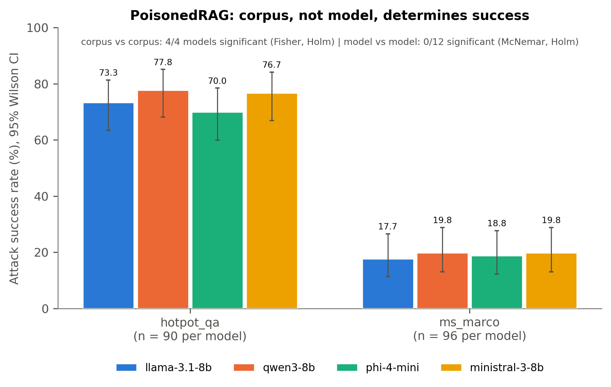

# Adversarial Robustness of Open-Source RAG Pipelines

**MSc dissertation (GISMA University of Applied Sciences) benchmarking the
adversarial robustness of small-to-mid-size (4–12B parameter) open-source
LLMs deployed in a retrieval-augmented generation (RAG) pipeline, mapped
onto the EU AI Act's Article 15 robustness requirements.**

If you are an examiner or supervisor, start here — this section tells you
what the project is, what it found, and where to read the full write-up.
Everything after "Repo structure" below is technical detail for anyone
who wants to reproduce or extend the work.

## What this dissertation does

Four open-source, instruction-tuned language models (`llama-3.1-8b`,
`qwen3-8b`, `phi-4-mini`, `ministral-3-8b`) are benchmarked across two
retrieval corpora (`hotpot_qa`, `ms_marco`) against three structurally
distinct attack families — indirect prompt injection, knowledge-corrupting
corpus poisoning (PoisonedRAG), and multi-turn conversational jailbreaking
(Crescendo) — and three low-cost defenses (`instruction_detection`,
`spotlighting`, `output_filter`). Every reported number comes from real
generations on real GPU hardware (RunPod A100, HuggingFace `transformers`
and vLLM), never simulated or estimated, and every significance test is a
paired exact test with Holm-Bonferroni correction, not an approximation.

The two questions the dissertation answers:

1. **How vulnerable are these four models to each attack family?**
   Vulnerability is real and substantial everywhere, but its shape is
   attack-specific: indirect injection is dominated by *model identity*,
   PoisonedRAG by *corpus identity*, and Crescendo by neither at the
   aggregate level, though each model reaches a similar attack-success
   rate through a distinct behavioral mechanism.
2. **How effective are practical, low-cost defenses, and at what cost?**
   Exactly one of three defenses tested, `spotlighting` against injection,
   clears the bar of a confirmed, backend-isolated real effect, and it
   does so at a severe utility cost. No defense tested here achieves both
   a confirmed effect and full utility preservation at once.

## Where to read the full dissertation

The complete dissertation source lives in this repository, under
[`thesis/`](thesis/). `thesis/main.tex` is the entry point; the six body
chapters are under `thesis/chapters/`, and the bibliography (41
peer-reviewed-first references) is under `thesis/attachments/`. Compile
with any standard LaTeX toolchain (`pdflatex` → `bibtex` → `pdflatex` ×2,
or `latexmk -pdf thesis/main.tex`) to produce the submitted PDF.

A pre-compiled copy of the final submitted PDF is also included directly
in the repository for convenience, at
[`thesis/M599_GH1037512_Simarjit_Singh_Dissertation.pdf`](thesis/M599_GH1037512_Simarjit_Singh_Dissertation.pdf)
— open this directly if you don't want to compile the LaTeX source
yourself. (This is a copy of `main.pdf` under the submission's required
filename; it will be removed or kept up to date manually going forward,
since it is not regenerated automatically by the build.)

For a narrative, prose account of the whole project without compiling
anything, read [`docs/THESIS_MASTER_RECORD.md`](docs/THESIS_MASTER_RECORD.md)
— it is self-contained and covers the research design, every phase's
final results, the real-hardware engineering story, the backend-confound
discovery and resolution, methodology, and limitations, in the same
depth as the dissertation itself.

**Status: the dissertation is complete.** All four phases (baseline,
attacks, defenses, EU AI Act Article 15 mapping) are finished with final,
backend-corrected results, and the full write-up is committed on `main`.

---

## Key findings


*Indirect injection: ministral-3-8b is the outlier; corpus identity, not model choice, drives PoisonedRAG success (see below).*



Nine result figures in total (baseline quality, `nq_open` exclusion
evidence, all three attacks, the backend-confound before/after,
defense-utility trade-off, and the `instruction_detection` false-positive
check) are captioned inline in
[`docs/THESIS_MASTER_RECORD.md`](docs/THESIS_MASTER_RECORD.md) and, in
full statistical detail with formal report/interpretation separation, in
the dissertation's Chapter 5.

- **The three attacks are each dominated by a different axis** — indirect
  injection by *model identity* (large, model-specific mechanism
  differences), PoisonedRAG by *corpus identity* (all four models
  statistically indistinguishable), and Crescendo by neither (outcome
  doesn't separate the four models, but the *mechanism* each one uses to
  get there is a strong per-model signature). No single "robustness
  score" summarizes all three.
- **A real inference-backend confound (`hf` vs `vllm`) was found
  mid-analysis and fully resolved, not just flagged.** Two of three
  defenses' headline results were overturned once corrected: see the next
  point.
- **Defense effectiveness, final and backend-corrected:** `spotlighting`
  is the only defense with a confirmed real effect on injection ASR (9/16
  cells), at a severe utility cost. `output_filter` shows **no**
  significant backend-isolated effect on injection (0/19) — its apparent
  effect was almost entirely the backend switch — and is a **structural
  architectural mismatch** against PoisonedRAG (a safety classifier flags
  0/160 factually-wrong-but-safe-sounding responses). `instruction_detection`
  shows 0/16 significant cells at n=40, but is **real, just underpowered**
  — mechanism attribution confirms 100% of genuinely-blocked items have a
  classifier flag behind them.
- **Real-hardware verification was not optional.** Eight distinct,
  genuinely blocking bugs in the two production defense modules were
  invisible to the mocked test suite and were only found running on real
  hardware against real model weights — a citable finding about testing
  this class of system, not incidental engineering trivia.
- **`nq_open` is excluded from every real comparison in this project** —
  its "retrieved context" is unfixable-by-construction gold-answer leakage,
  confirmed by both direct inspection and a near-ceiling, near-invariant
  F1 pattern across all four models.
- **This dissertation maps its own findings onto EU AI Act Article
  15(5)** as a technical exercise, not a legal compliance claim, and
  documents that no harmonised testing standard for this kind of
  robustness evidence exists yet (`prEN 18229-2` and `prEN 18282` both
  remain in draft as of this writing).

Full detail, numbers, and statistical tests for every point above:
`docs/THESIS_MASTER_RECORD.md`, or Chapters 4–5 of the dissertation
itself.

---

## Quick links

- **[`thesis/`](thesis/)** — the dissertation itself: LaTeX source,
  chapters, bibliography. Compile `thesis/main.tex` for the submitted PDF.
- **[`THESIS_MASTER_RECORD.md`](docs/THESIS_MASTER_RECORD.md)** — the full
  narrative record, self-contained, no compilation needed.
- **[`THESIS_ARCHITECTURE.md`](docs/THESIS_ARCHITECTURE.md)** — visual
  companion: Mermaid diagrams of the project flow, experimental design
  matrix, infrastructure/pipeline, attack and defense mechanisms, and the
  bug-discovery timeline.
- **[`CITATIONS.md`](docs/CITATIONS.md)** — the peer-reviewed reference list
  (see [Citation policy](#citation-policy) below).

**Underlying detailed sources** (each already consolidated into
`THESIS_MASTER_RECORD.md`, but the primary write-up for its own phase):

- [`PHASE2_INJECTION_INSIGHTS.md`](docs/PHASE2_INJECTION_INSIGHTS.md) — indirect prompt injection, full statistical detail.
- [`PHASE2_POISONEDRAG_INSIGHTS.md`](docs/PHASE2_POISONEDRAG_INSIGHTS.md) — PoisonedRAG corpus poisoning, full statistical detail.
- [`PHASE2_CRESCENDO_INSIGHTS.md`](docs/PHASE2_CRESCENDO_INSIGHTS.md) — Crescendo multi-turn jailbreak, full statistical detail.
- [`PHASE3_DEFENSE_INSIGHTS.md`](docs/PHASE3_DEFENSE_INSIGHTS.md) — all three defenses, final backend-corrected results.

---

## Repo structure
---

```
rag-adversarial-robustness/
├── thesis/                            # the dissertation itself
│   ├── main.tex                       # entry point; compile this
│   ├── chapters/                      # Introduction, Foundations, Related Work,
│   │                                   # Approach, Evaluation, Conclusion
│   └── attachments/
│       └── bibliography.bib           # 41 references, peer-reviewed-first policy
├── config.py                          # models, corpora, pinned revisions, seeds
├── harness/
│   ├── model_loader.py                # per-model load + chat-template rendering
│   ├── pipeline.py                    # retrieve -> prompt -> generate (Phase 1 core)
│   └── vllm_engine.py                 # batched vLLM load + generate path
├── data/
│   ├── loader.py                      # corpus loading, fixed-seed sampling
│   ├── normalize.py                   # per-corpus field/passage extraction
│   ├── build_index.py                 # FAISS index build + retrieval
│   └── behavior_pool.py               # Crescendo's JBB-Behaviors + HarmBench pool
├── attacks/
│   ├── injection_templates.py         # 5 injection strategies, goal/process taxonomy
│   ├── indirect_injection.py          # Attack 1: injected-context prompt builder
│   ├── poisonedrag.py                 # Attack 2: poison-passage generator (NIM)
│   ├── poisoned_retrieval.py          # Attack 2: poisoned-context rendering
│   ├── crescendo.py                   # Attack 3: multi-turn escalation/backtrack
│   ├── asr_scoring.py                 # injection ASR substring scoring
│   └── poison_scoring.py              # PoisonedRAG ASR scoring
├── defenses/
│   ├── instruction_detection.py       # per-passage DeBERTa injection classifier
│   ├── spotlighting.py                # base64 encoding-mode defense
│   └── output_filter.py               # Llama-Guard-4-12B post-generation filter
├── evaluation/
│   ├── run_baseline.py                # Phase 1 sweep entry point
│   ├── run_attack_injection.py        # Phase 2 Attack 1 sweep
│   ├── run_poisonedrag.py             # Phase 2 Attack 2 sweep
│   ├── run_crescendo.py               # Phase 2 Attack 3 sweep
│   ├── result_paths.py                # filename convention, bakes in engine used
│   ├── metrics.py                     # EM / F1 / Recall@5
│   └── stats.py                       # McNemar, Fisher, Holm-Bonferroni, bootstrap
├── scripts/                           # sweep utilities, RunPod watcher, verification/analysis scripts
├── tests/                             # pytest suite (mocked — no GPU/weights needed)
├── phase1_results_complete/           # Phase 1 baseline raw + summary (final)
├── phase2_injection_results/          # Attack 1 raw + summary
├── phase2_poisonedrag_results/        # Attack 2 raw + summary
├── phase2_crescendo_results/          # Attack 3 raw + summary
├── phase3_defense_results/            # All 3 defenses' raw + summary + mechanism logs
├── notebooks/
│   └── results_analysis.ipynb         # regenerates fig01-fig09; cross-checks every number vs the master record
├── results/
│   └── figures/                       # 300 DPI PNGs written by the notebook
├── docs/
│   ├── PHASE2_INJECTION_INSIGHTS.md
│   ├── PHASE2_POISONEDRAG_INSIGHTS.md
│   ├── PHASE2_CRESCENDO_INSIGHTS.md
│   ├── PHASE3_DEFENSE_INSIGHTS.md
│   ├── PHASE4_EU_AI_ACT_MAPPING.md
│   ├── NQ_OPEN_SCOPE_DECISION.md
│   ├── SUPERVISION_MEETINGS_LOG.md
│   ├── nq_open_leakage_finding.md     # why nq_open is excluded project-wide
│   ├── CITATIONS.md
│   ├── THESIS_MASTER_RECORD.md
│   ├── THESIS_ARCHITECTURE.md
│   └── archive/task-briefs/           # one-off task-brief/prompt files, historical record
└── README.md                          # this file
```


(A handful of task-brief `.md` files and per-bug fix write-ups also live
under `docs/archive/task-briefs/` — real engineering narrative, consolidated
into `THESIS_MASTER_RECORD.md` Sections 3 and 7 rather than duplicated here.)

---

## Setup / running instructions

Requires **Python 3.13** (the Dockerfile pins `python:3.13-slim`; 3.14 is
blocked by vLLM's dependency tree — see vllm-project/vllm#34096).

```bash
git init
python -m venv .venv && source .venv/bin/activate
pip install -r requirements.txt
cp .env.example .env   # fill in the API keys below
huggingface-cli login  # or export HUGGINGFACE_HUB_TOKEN from .env
```

**Before running anything:** `llama-3.1-8b` (Llama-3.1-8B-Instruct) is
gated on HuggingFace — accept Meta's license on the model page first.
`ministral-3-8b` needs a recent `transformers` version for
`Mistral3ForConditionalGeneration` (`pip install -U transformers` if the
import in `harness/model_loader.py` fails). Every model is pinned to an
exact HuggingFace commit hash in `config.py` for reproducibility — don't
touch those unless you're deliberately re-pinning.

### API keys, by component

| Variable | Needed for | Notes |
|---|---|---|
| `HF_TOKEN` / `HUGGINGFACE_HUB_TOKEN` | Always | Gated `llama-3.1-8b` + general HF downloads |
| `NVIDIA_NIM_API_KEY` | PoisonedRAG poison generation, Crescendo attacker/judge | `nemotron-3-ultra-550b-a55b` and `deepseek-v4-pro-0813` both served via NIM |
| `OPENROUTER_API_KEY` | Crescendo (fallback transport) | `attacks/crescendo.py`; used when NIM's ~40 req/min limit is exhausted mid-sweep, via `CRESCENDO_LLM_PROVIDER` |
| `RUNPOD_API_KEY` | Not user-set | RunPod auto-injects this into the pod environment itself |

`.env.example` documents all four; copy it to `.env` and fill in the
ones you need.

### Core environment variables (all optional, sensible defaults)

| Variable | Purpose | Values |
|---|---|---|
| `RAG_MODELS` | Filter which models run | comma-separated model keys, default all 4 |
| `RAG_CORPORA` | Filter which corpora run | comma-separated corpus names |
| `RAG_SAMPLE_N` | Items per cell | integer |
| `RAG_DEFENSE` | Phase 3 defense to apply | `none` (default) / `instruction_detection` / `spotlighting` / `output_filter` |
| `INFERENCE_ENGINE` | Generation backend | `hf` (default, `transformers`) / `vllm` |
| `RAG_INJECTION_TEMPLATES` | Filter injection templates | comma-separated: `naive,escape_char,ignore,fake_completion,combined` |
| `RAG_SCRATCH_DIR` | Where results/cache are written | path |

Full list (vLLM tuning, Crescendo turn/provider controls, the RunPod
watcher's target/timeout) is documented inline in each module — not
reproduced exhaustively here.

### Running a sweep

Build the retrieval side first (model-independent):

```bash
python -m data.loader
python -m data.build_index
python -m scripts.verify_ministral_text_only   # confirms the vision tower never fires on text-only input
```

Then each phase:

```bash
python -m evaluation.run_baseline           # Phase 1: clean-query baseline
python -m evaluation.run_attack_injection   # Phase 2, Attack 1: indirect prompt injection
python -m evaluation.run_poisonedrag        # Phase 2, Attack 2: PoisonedRAG
python -m evaluation.run_crescendo          # Phase 2, Attack 3: Crescendo
```

Phase 3 defenses are wired into the **same** attack runners, not separate
scripts — set `RAG_DEFENSE` before running `run_attack_injection.py` /
`run_poisonedrag.py` (all three defenses apply) or `run_crescendo.py`
(`output_filter` only — Crescendo has no retrieved content for
`instruction_detection`/`spotlighting` to act on, and its guard verdict is
logged but deliberately never enforced; see
`THESIS_MASTER_RECORD.md` Section 6.3, or the dissertation's Chapter 5,
Section "Defense Evaluation and the Backend-Confound Discovery").

### Results notebook

[`notebooks/results_analysis.ipynb`](https://github.com/Simarjit1303/rag-adversarial-robustness/blob/main/notebooks/results_analysis.ipynb) regenerates all 9 result figures from
the committed result directories only — never the untracked scratch
dirs. Before plotting anything, it runs 297 assertions against
`docs/THESIS_MASTER_RECORD.md` (Sections 5, 6, 8, 9) and the `nq_open`
table in `docs/NQ_OPEN_SCOPE_DECISION.md`, at tolerances matched to each
table's printed precision, and stops on any mismatch instead of
producing a chart with drifted numbers.

Run from the repo root or from `notebooks/`:

```bash
jupyter nbconvert --to notebook --execute notebooks/results_analysis.ipynb
```

Figures save to `results/figures/` at 300 DPI. `nq_open` never appears
as a result — only once, as excluded leakage evidence (fig02).

### Cloud deployment (RunPod A100 + GHCR)

This is how the project actually runs at scale, not just local execution.
Pushing to `main` builds a Docker image and pushes it to GHCR — nothing
more (the workflow also contains an Azure Container-Apps-Job update step
left over from an earlier deployment target; it's dead — it fails
harmlessly since that Job was never provisioned, and the GHCR build above
it succeeds independently). A human then pulls that image on a RunPod A100
pod and sets the pod template's **"Start command" override** to:

```bash
python -m scripts.run_and_terminate
```

which runs the selected sweep (`RAG_RUN_TARGET`), verifies real output
files exist and are non-empty, and terminates the pod **only on confirmed
success** — a failed or hung run is left alive for inspection rather than
silently billing forever or erasing its own evidence. See
`THESIS_ARCHITECTURE.md` Section 3 for the full infrastructure diagram.

---

## Current project status

- **Phase 1 (baseline):** Complete. 4 models × 2 corpora used in every
  real comparison (`nq_open` collected but excluded — see below), n=1000
  each.
- **Phase 2 (attacks):** Complete. All three attacks swept and written up.
- **Phase 3 (defenses):** Complete, with final backend-corrected results.
  An inference-backend confound (`hf` vs `vllm`) was discovered
  mid-analysis and fully resolved; see [Key findings](#key-findings) above
  and `THESIS_MASTER_RECORD.md` Section 8.
- **Phase 4 (EU AI Act Article 15 mapping):** Complete —
  see [`docs/PHASE4_EU_AI_ACT_MAPPING.md`](docs/PHASE4_EU_AI_ACT_MAPPING.md),
  which verifies the regulatory context directly, quotes Article 15's real
  requirements, and maps them against this project's final Phase 1–3
  results.
- **Dissertation write-up:** Complete and committed under
  [`thesis/`](thesis/). `docs/THESIS_MASTER_RECORD.md` was the backbone
  used to write it and remains a faithful, self-contained companion to
  the finished dissertation.
- **Branch:** all work is merged into `main`; this is the current,
  submitted state of the project.

---

## Citation policy

Peer-reviewed venues only — ACM, IEEE, PMLR, USENIX, ACL Anthology,
CEUR-WS — with bare arXiv preprints avoided except where a technical
report or model card is the only citable source for a specific model
artifact, each flagged explicitly as such at the point of citation. See
[`CITATIONS.md`](docs/CITATIONS.md) for the full reference list and its
stated inclusion policy.

---

## How to cite this work

If you use this benchmark, its results, or its methodology in your own
work, please cite the dissertation directly.

**Plain text:**

> Singh, S. (2026). *Adversarial Robustness of Open-Source RAG Pipelines*.
> MSc dissertation, GISMA University of Applied Sciences. Available at:
> https://github.com/Simarjit1303/rag-adversarial-robustness

**BibTeX:**

```bibtex
@mastersthesis{singh2026ragrobustness,
  author = {Singh, Simarjit},
  title  = {Adversarial Robustness of Open-Source RAG Pipelines},
  school = {GISMA University of Applied Sciences},
  year   = {2026},
  type   = {MSc dissertation},
  url    = {https://github.com/Simarjit1303/rag-adversarial-robustness}
}
```

If you specifically build on the codebase, the benchmark design, or the
backend-confound correction methodology rather than the dissertation's
findings, please also link back to this repository directly so others
can trace results to their exact source implementation and commit.

---

## Known things to double-check before trusting output

1. **Dataset field names.** `data/normalize.py` maps each corpus's
   question/answer/context fields to a common schema — confirm against
   the live dataset the first time you load it
   (`print(records[0].keys())`), since HF dataset schemas do shift.
2. **Qwen3 thinking mode.** `config.QWEN3_ENABLE_THINKING` is fixed
   (`False`) for the whole benchmark — don't let it vary silently between
   runs.
3. **Greedy decoding.** Generation uses `do_sample=False` throughout, for
   reproducibility.
4. **`nq_open` is not a valid RAG baseline for this project** — see
   `nq_open_leakage_finding.md` and `THESIS_MASTER_RECORD.md` Section 4
   before citing any `nq_open` number as comparable to `hotpot_qa`/`ms_marco`.